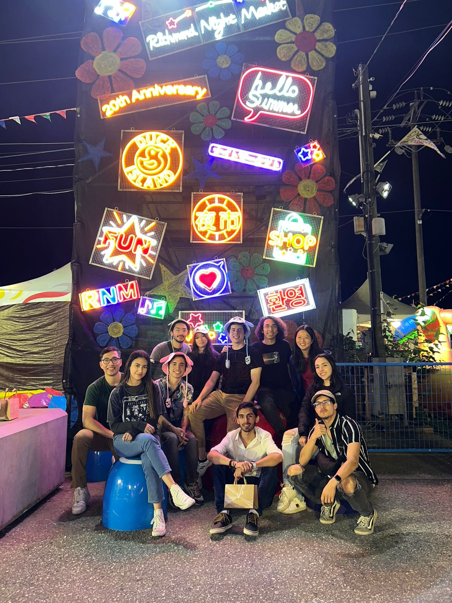

# hello_worldS62023

Aprender a crear un repositorio

# 1. Crear encabezados
# Mauro Alejandro Martínez Lozano 
## ITC
## A01282152

# 2. Indicar énfasis
- Negrita \*\***Hoy es martes**\*\*
- Cursiva \**Asi*\* o \__Asi_\_
- Tachado \~~Hoy es lunes~\~
- Cursiva y negrita \*\*\_**_Holis_**\_\*\*

# 3. Usar emojis
😸

# 4. Listas ordenadas
1. Mauro Martínez
2. Claudia Torres
3. Sebastian Jaime
4. Claudia Arciénega

# 5. Listas sin orden
- Hamburguesas
- Pizza
- Tacos
- Tortas de pierna

# 6. Código
``` python
def step():
    """Compute one step in the Game of Life."""
    neighbors = {}

    for x in range(-190, 190, 10):
        for y in range(-190, 190, 10):
            count = -cells[x, y]
            for h in [-10, 0, 10]:
                for v in [-10, 0, 10]:
                    count += cells[x + h, y + v]
            neighbors[x, y] = count

    for cell, count in neighbors.items():
        if cells[cell]:
            if count < 2 or count > 3:
                cells[cell] = False
        elif count == 3:
            cells[cell] = True
```

# 7. Regla Horizontal
___

# 8. Link
[freegames](https://grantjenks.com/docs/freegames/#user-guide)

# 9. Foto


# 10. Tabla
| oper1 | oper2 | Resultado |
| ---- | ---- | ---- | 
| True | True | True |
| True | False | False |
| False | True | False |
| False | False | False |

# 11. Opciones
- [X] Triangulo
- [ ] Circulo
- [X] Cuadrado
